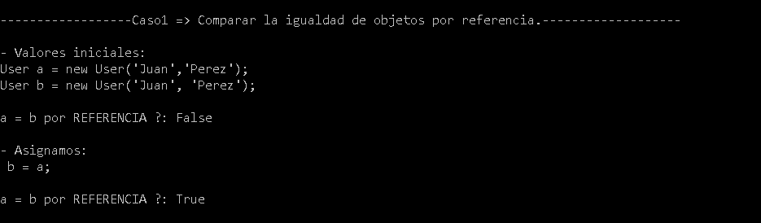

# Comparacion de objetos
El objetivo es aprender como comparar la igualdad de objetos.

## Informacion
**Hay tres tipos de igualdad de objetos:**
**Igualdad por referencia:** significa que dos variables del mismo tipo son iguales porque tienen la misma referencia en memoria.
Ej. cuando asignamos una Entity a otra, cualquier valor que modifiquemoa se vera afectada en las dos.
**Igualdad por identificador:** significa que dos variables del mismo tipo, que no tienen la misma referencia en memoria, son iguales porque tienen la misma identificacion.
Ej. cuando un objeto tiene su key que coincide con la de la base de datos.
**Igualdad por valores:** significa que dos objetos del mismo tipo, que no tienen la misma referencia en memoria y que no tienen una key que los identifique, son iguales porque tienen los mismos valores. 
Ej. cuando un objeto no tiene su propia identidad como los Value Object (+info Value Object: https://goo.gl/HLH3BR | https://goo.gl/Z4PvUz).

## Caso1
Comparar la igualdad de objetos por referencia.
### Problema
¿ Como hacemos para saber si dos objetos del mismo tipo son iguales, cuando NO tienen una key que los identifique(ej. Id unico) y NO tienen los mismos valores en sus campos ?
### Solucion
Compararlos por sus referencias.
### Resultado

## Caso2
Comparar la igualdad de objetos por valores.
### Problema
¿  Como hacemos para saber si dos objetos del mismo tipo son iguales, cuando NO tienen una key que los identifique(ej. Id unico) y NO tienen la misma referencia en memoria ? 
### Solucion
Compararlos por los valores de sus campos, en este caso vamos a modificar los Equals de los objetos para poder comparar los valores.
### Resultado

## Caso3
Comparar la igualdad de objetos por identificacion.
### Problema
¿  Como hacemos para saber si dos objetos del mismo tipo son iguales, cuando NO tienen los mismos valores en sus campos y NO tienen la misma referencia en memoria ? 
### Solucion
Compararlos por sus identificaciones, en este caso vamos a crear una clase base para evitar duplicar codigo en cada objeto.
### Resultado
